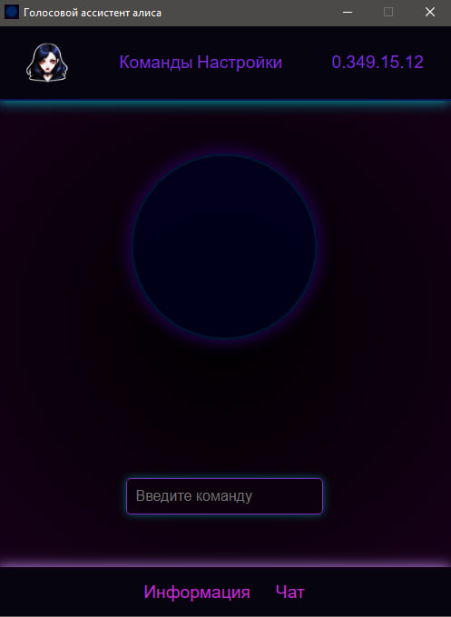

<body>
    

        
        <h1>Voice Assistant</h1>
    

    

        
        
    

    

        <h2 align="center">По сборке:</h2>
        <ol>
            <li><strong>Скачивание модели:</strong>
                
Перейдите по следующей ссылке для скачивания модели речи: <a href="https://alphacephei.com/vosk/models" target="_blank">https://alphacephei.com/vosk/models</a>

                
Выберите подходящую модель для вашего проекта и скачайте её.

            </li>
            <li><strong>Поместить модель в нужную папку:</strong>
                
После того как модель будет скачана, поместите её в папку: <code>assistant\server\system\stt\model\model_name</code>.

                
Убедитесь, что модель находится в правильной директории, заменив <code>model_name</code> на vosk-model

            </li>
            <li><strong>Сборка программы в EXE файл:</strong>
                
Чтобы собрать программу в исполняемый файл <code>.exe</code>, выполните следующие шаги:

                <ul>
                    <li>Переместите файл <code>builder.py</code> в папку с проектом <code>assistant</code>.</li>
                    <li>Запустите файл <code>builder.py</code> с помощью Python. Для этого откройте командную строку или терминал в папке с файлом и выполните команду:</li>
                    <pre><code>python builder.py</code></pre>
                    <li>Дождитесь окончания процесса сборки. Программа создаст EXE файл в build директории.</li>
                </ul>
            </li>
        </ol>
        
Теперь ваш проект готов к использованию.

      

      
      

      

    </body>
</html>
